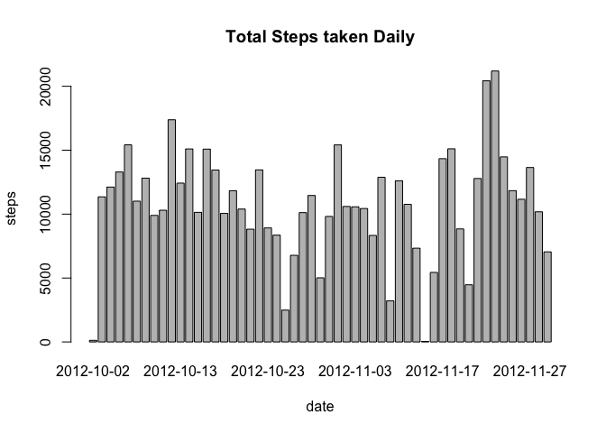
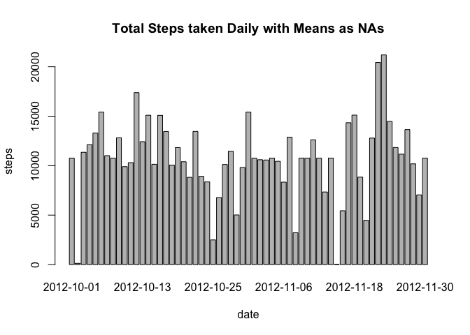

# Reproducible Research: Peer Assessment 1
Sean Hegarty  
January 17, 2015  


## Loading and preprocessing the data
1. Load the data using `read.csv` function.

```r
data <- read.csv("activity.csv", colClasses = c("integer","Date","factor"))
```
2. Process/transform the data into an `NA` free format suitable for analysis.

```r
data.Rna <- na.omit(data)
```

## What is mean total number of steps taken per day?
1. Make a histogram of the total number of steps taken each day


```r
dailySteps <- aggregate(data.Rna$steps,by = list(data.Rna$date), FUN=sum)
names(dailySteps) <- c("date","steps")
barplot(dailySteps$steps, names.arg = dailySteps$date, xlab = "date", ylab = "steps")
```

 

2. Calculate and report the mean and median total number of steps taken per day

```r
mean(dailySteps$steps)
```

```
## [1] 10766.19
```

```r
median(dailySteps$steps)
```

```
## [1] 10765
```


## What is the average daily activity pattern?
1. Make a time series plot of the 5-minute interval (x-axis) and the average number of steps taken, averaged across all days (y-axis)
 
2. Which 5-minute interval, on average across all the days in the dataset, contains the maximum number of steps?

```
## [1] 835
```


## Imputing missing values
1. Total number of missing values in the dataset

```
## [1] 2304
```
2. Devise/Create/Plot/Calculate

        + Devise a strategy for filling in all of the missing values in the dataset with the interval mean. 
        
        + Create a new dataset that is equal to the original dataset but with the missing data filled in.

        + Plot a histogram of the total number of steps taken daily. 

```r
dailySteps2 <- aggregate(steps ~ date, data.intMean, sum)
barplot(dailySteps2$steps, names.arg = dailySteps2$date, xlab = "date", ylab = "steps")
```

 
        + Calculate the mean and median total number of steps taken daily.

```r
mean(dailySteps2$steps)
```

```
## [1] 10766.19
```

```r
median(dailySteps2$steps)
```

```
## [1] 10766.19
```
3. Replacing `NA` values with the mean interval values allows the median to match the mean. This was not the case in the original `data`. Imputing `NA` data changes the descriptive statistics.

```r
mean(dailySteps2$steps) - mean(dailySteps$steps)
```

```
## [1] 0
```

```r
median(dailySteps2$steps) - median(dailySteps$steps)
```

```
## [1] 1.188679
```

## Are there differences in activity patterns between weekdays and weekends?

1. Create a new factor variable in the dataset with two levels – “weekday” and “weekend”.

```
## 
## weekday weekend 
##   12960    4608
```
2. Panel plot a time series plot of the 5-minute interval (x-axis) and the average number of steps taken, averaged across all weekday days or weekend days (y-axis).

```r
par(mfrow = c(2, 1))
for (type in c("weekend", "weekday")) {
    dayType <- aggregate(steps ~ as.numeric(as.character(interval)), 
                            data = data.intMean, 
                            subset = data.intMean$day == type, 
                            FUN = mean)
    plot(dayType, type = "l", main = type, 
         xlab = "Interval in Minutes", ylab = "Steps")
}
```

 
