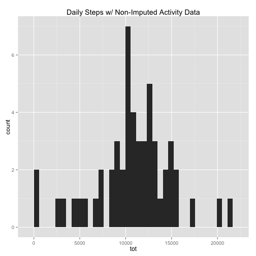

```r
#Project 1 Directory Setup
ProjectDir<- getwd()
if (ProjectDir!="~/Desktop/DataScience/RepResearch/Project1"){
  print("Changing Directory")
  setwd("~/Desktop/DataScience/RepResearch/Project1")
  ProjectDir<- getwd()
}
```

```
## [1] "Changing Directory"
```

```r
#File Download
if(!"activity.csv" %in% dir("data")){
  print("Downloading Activity Data")
  fileURL<- "https://d396qusza40orc.cloudfront.net/repdata%2Fdata%2Factivity.zip"
  download.file(fileURL, destfile = "data/repdata-data-activity.zip",
                method="curl")
  unzip("data/repdata-data-activity.zip",exdir="data", files="activity.csv")
}

#Libraries and Settings
library(ggplot2)
library(scales)
library(plyr)
echo=TRUE

#Data Processing
if(!"activity" %in% ls()){
  print("Importing Activity Data into Environment")
  activity <- read.csv("data/activity.csv",colClasses=c("integer","Date","factor"))
}
```

```
## [1] "Importing Activity Data into Environment"
```

###What is the mean total number of steps taken per day?

```r
#Exploratore Data Frame
dim(activity)
```

```
## [1] 17568     3
```

```r
head(activity)
```

```
##   steps       date interval
## 1    NA 2012-10-01        0
## 2    NA 2012-10-01        5
## 3    NA 2012-10-01       10
## 4    NA 2012-10-01       15
## 5    NA 2012-10-01       20
## 6    NA 2012-10-01       25
```

```r
sapply(activity,class)
```

```
##     steps      date  interval 
## "integer"    "Date"  "factor"
```

```r
naFree <- na.omit(activity)
activity$interval <- as.integer(as.character(activity$interval))

#Explore daily Central Tendency
dailySteps <- ddply(naFree,c("date"),summarise,tot=sum(steps))
```

```r
DailyStepsHist <- qplot(data=dailySteps,tot,
                        geom="histogram",
                        main="Daily Steps w/ Non-Imputed Activity Data",
                        binwidth=dim(activity)[1]/30)
DailyStepsHist
```

 

As we can see below, the median and the mean lie very close to each other. A difference of only 1.19 steps.


```r
mean(dailySteps$tot)
```

```
## [1] 10766.19
```

```r
median(dailySteps$tot)
```

```
## [1] 10765
```

###What is the average daily activity pattern?

```r
#Explore 5 minute interval means
intervalSteps <- ddply(naFree,c("interval"),summarise,mn=mean(steps))
intervalSteps$interval <- as.integer(as.character(intervalSteps$interval))
intervalSteps <- arrange(intervalSteps,interval)
```

```r
IntMeansPlot<-qplot(data=intervalSteps,y=mn,x=interval,
                    geom="line",
                    main="Average Steps per 5-minute Interval")
IntMeansPlot
```

 

Below, the interval with the highest average steps is shown. The statistic says that the highest average number of steps are taken in the 5 minute interval between 8:35am and 8:40am. That maximum is 206.1698. I would speculate this is because everyone is running late for work.


```r
#Maximum Step interval
head(arrange(intervalSteps,desc(mn)),1)
```

```
##   interval       mn
## 1      835 206.1698
```

###Imputing missing data
In order to generate a complete dataset, I have imputed the NA values with their particular 5 minute interval mean.


```r
#Impute Missing Data with Interval Means
naData <- activity[is.na(activity$steps),]
dim(naData)[1]
```

```
## [1] 2304
```

```r
for (i in 1:nrow(naData)){
  naData$steps[i] <- intervalSteps[intervalSteps$interval==naData$interval[i],]$mn
}
naData$rNames<-as.integer(row.names(naData))
temp <- activity
for (i in naData$rNames){
  temp$steps[i] <- naData[naData$rNames==i,]$steps
}

#Explore daily Central Tendency after Imputing missing Values
ImpDailySteps <- ddply(temp,c("date"),summarise,tot=sum(steps))
```

```r
ImpDailyStepHist <- qplot(data=ImpDailySteps,tot,
                          geom="histogram",
                          main="Daily Steps w/ Imputed Activity Data",
                          binwidth=dim(activity)[1]/30)
ImpDailyStepHist
```

 

By comparison between the dataset with NA values removed and the imputed dataset, the means and medians are almost exactly the same. However, in the imputed dataset, the median is able to equal a non-integer value, when in reality a person cannot take 0.19 of a step.


```r
mean(ImpDailySteps$tot)
```

```
## [1] 10766.19
```

```r
median(ImpDailySteps$tot)
```

```
## [1] 10766.19
```

```r
#Compare Imputed and NA-free Datasets
imputed <- c(mean(ImpDailySteps$tot),median(ImpDailySteps$tot))
nonimputed <- c(mean(dailySteps$tot),median(dailySteps$tot))
ImpVnon <- data.frame(rbind(imputed,nonimputed))
names(ImpVnon)<-c("Mean","Median")
ImpVnon
```

```
##                Mean   Median
## imputed    10766.19 10766.19
## nonimputed 10766.19 10765.00
```

###Are there differences in activity patterns between weekdays and weekends?

```r
#Weekdays vs Weekends
temp$dayName <- weekdays(activity$date)

weekend<-c("Saturday","Sunday")
for (i in 1:nrow(temp)){if (temp$dayName[i] %in% weekend){temp$weekend[i]<-"Weekend"}
                        else{temp$weekend[i]<-"Weekday"}}
temp$weekend<-as.factor(temp$weekend)

#Explore 5 minute interval means for Weekdays VS Weekends
endIntSteps <- aggregate(temp$steps,
                         list(interval=as.integer(as.character(temp$interval)),
                              weekday=temp$weekend),
                         FUN="mean")
endIntSteps <- arrange(endIntSteps,interval)
names(endIntSteps)[3]<-"AverageSteps"
```

It would appear from the graph below that people are less active during the early morning hours but are more consistently active throughout the day during the weekend.My earlier speculation about the morning work rush still holds.


```r
IntMnsEnd <- qplot(data=endIntSteps,y=AverageSteps,x=interval,
                   geom="line",facets=weekday~.,
                   main="Average Steps per 5-minute Interval")
IntMnsEnd 
```

 

###Every Day Comparison
As an added bonus, I thought it would be interesting to compare every day of the week in the dataset and graphs below.


```r
#Explore 5 minute interval means for every weekday
dayIntSteps <- aggregate(temp$steps,
                         list(interval=as.integer(as.character(temp$interval)),
                              dayName=factor(temp$dayName)),
                         FUN="mean")
dayIntSteps <- arrange(dayIntSteps,interval)
names(dayIntSteps)[3] <-"AverageSteps"
```

```r
IntMnsDays <- qplot(data=dayIntSteps,y=AverageSteps,x=interval,
                    geom="line",facets=dayName~.,
                    main="Average Steps per 5-minute Interval")
IntMnsDays
```

 


